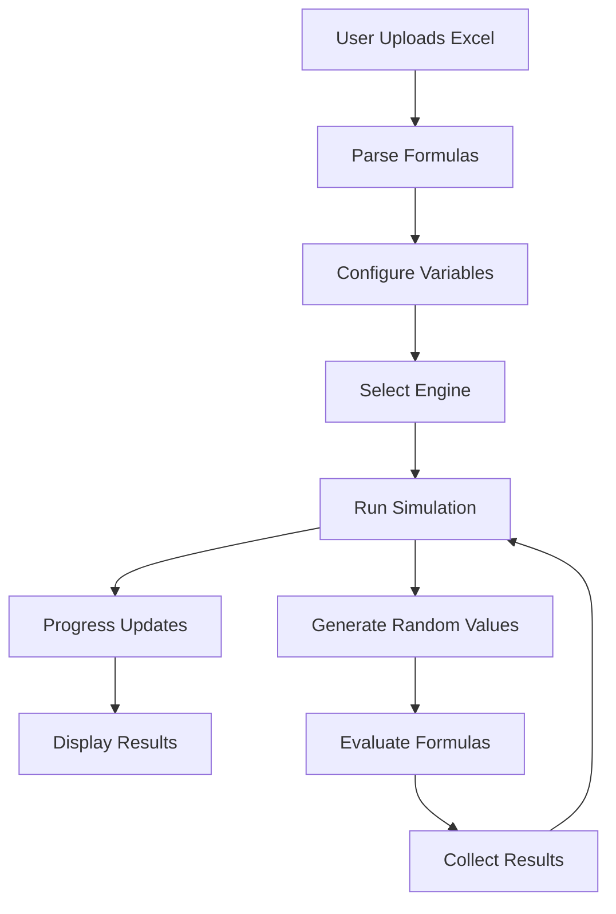

# Monte Carlo Simulation Platform - Complete Architecture Understanding

## Overview

This is a sophisticated web-based Monte Carlo simulation platform that allows users to upload Excel files, define probability distributions for variables, and run simulations to understand outcome uncertainty.

## System Architecture

### Frontend (React + TypeScript)
```
frontend/
├── src/
│   ├── components/
│   │   ├── ExcelGrid/          # Excel-like grid display
│   │   ├── SimulationResults/  # Results visualization
│   │   └── UnifiedProgress/    # Progress tracking UI
│   ├── redux/                  # State management
│   └── services/               # API communication
```

### Backend (FastAPI + Python)
```
backend/
├── simulation/
│   ├── engine.py              # Base Monte Carlo engine
│   ├── enhanced_engine.py     # WorldClass GPU engine
│   ├── power_engine.py        # Power Engine (high-performance)
│   ├── big_engine.py          # Big Files engine
│   └── service.py             # Engine orchestration
├── excel_parser/              # Excel file processing
├── gpu/                       # GPU acceleration support
└── shared/                    # Common utilities
```

## Available Engines

### 1. **Standard Engine** (engine.py)
- Basic Monte Carlo simulation
- CPU-based processing
- Good for small to medium files
- Supports basic Excel functions

### 2. **Enhanced/WorldClass Engine** (enhanced_engine.py)
- GPU-accelerated processing
- Advanced formula compilation
- Enterprise features
- Intelligent caching

### 3. **Power Engine** (power_engine.py) [[memory:2150576]]
- **Purpose**: Ultra-high performance for large Excel files
- **Features**:
  - 16-worker parallel processing
  - Intelligent batching (1000 iterations/batch)
  - GPU acceleration with CUDA
  - VLOOKUP support with text handling
  - Streaming data processing
  - Memory-mapped file handling
- **Performance**: ~2 minutes for 1000 iterations

### 4. **Big Files Engine** (big_engine.py)
- Specialized for very large Excel files
- Chunk-based processing
- Memory optimization
- Sparse matrix support

### 5. **Arrow Engine** (Not in current deployment)
- Apache Arrow based
- Columnar data processing
- For specific use cases

## How Simulations Work

### 1. File Upload & Parsing
```python
# User uploads Excel file
# Backend parses formulas and identifies dependencies
all_formulas = await get_formulas_for_file(file_id)
```

### 2. Variable Configuration
Users define probability distributions:
- **Triangular**: Min, Most Likely, Max values
- **Normal**: Mean, Standard Deviation
- **Uniform**: Min, Max values

### 3. Dependency Analysis
```python
# System analyzes formula dependencies
ordered_calc_steps = get_evaluation_order(
    target_sheet, target_cell, all_formulas, mc_inputs
)
```

### 4. Monte Carlo Execution
```python
# Run N iterations with random sampling
for iteration in range(iterations):
    # Generate random values for variables
    # Evaluate all formulas in dependency order
    # Collect results
```

### 5. Results Analysis
- **Histogram**: Distribution of outcomes
- **Statistics**: Mean, Std Dev, Percentiles
- **Sensitivity**: Variable impact analysis

## Progress Tracking System

### Backend Progress Updates
```python
progress_callback({
    "simulation_id": sim_id,
    "progress_percentage": 60,
    "stage": "analysis",
    "stage_description": "Formula Analysis",
    "current_iteration": 500,
    "total_iterations": 1000
})
```

### Progress Stages
1. **Initialization** (20%): File validation
2. **Parsing** (40%): Excel file parsing
3. **Analysis** (60%): Dependency analysis
4. **Simulation** (80%): Monte Carlo iterations
5. **Results** (100%): Generating output

### Frontend Progress Display
- Real-time WebSocket updates
- Visual progress bar
- Stage descriptions
- Iteration counter

## Data Flow



## Key Technologies

### Backend
- **FastAPI**: Modern async web framework
- **Pandas/NumPy**: Data processing
- **CuPy**: GPU acceleration
- **Formulas**: Excel formula parsing
- **Redis**: Progress tracking
- **PostgreSQL**: Data persistence

### Frontend
- **React 18**: UI framework
- **Redux Toolkit**: State management
- **AG-Grid**: Excel-like grid
- **Recharts**: Data visualization
- **WebSockets**: Real-time updates

## GPU Acceleration

### Detection
```python
# Automatic GPU detection
GPU Available: True (NVIDIA GeForce RTX 3070)
Total Memory: 8127MB
Available: 6501.6MB
```

### Usage
- Matrix operations on GPU
- Parallel random number generation
- Vectorized formula evaluation
- Memory pooling for efficiency

## Error Handling

### Graceful Degradation
- GPU → CPU fallback
- Complex formula → Simple evaluation
- Memory issues → Batch size reduction

### User Feedback
- Clear error messages
- Progress tracking continues
- Partial results available

## Performance Optimizations

### 1. **Batching**
- Process 1000 iterations at once
- Vectorized operations
- Reduced memory allocation

### 2. **Caching**
- Formula compilation cache
- Constant value cache
- Result memoization

### 3. **Parallel Processing**
- Multi-threaded execution
- Async I/O operations
- Worker pool management

## Security Considerations

### Input Validation
- Excel formula sandboxing
- File size limits
- User authentication (Auth0)

### Safe Evaluation
```python
SAFE_EVAL_NAMESPACE = {
    'SUM': safe_sum,
    'VLOOKUP': excel_vlookup,
    'IF': safe_if,
    # ... other safe functions
}
```

## Deployment Architecture

### Docker Containers
- **Backend**: FastAPI application
- **Frontend**: Nginx + React
- **Database**: PostgreSQL
- **Cache**: Redis
- **GPU**: CUDA runtime

### Environment
- Ubuntu Linux 20.04
- Python 3.9+
- Node.js 16+
- CUDA 11.x

## Common Issues & Solutions

### 1. Progress Stuck at 18%
- **Cause**: Engine mismatch in progress tracking
- **Solution**: Clear Redis cache, ensure correct engine selection

### 2. GPU Not Detected
- **Cause**: CUDA drivers or CuPy issues
- **Solution**: Fallback to CPU mode automatically

### 3. Large File Timeouts
- **Cause**: Memory constraints
- **Solution**: Use Big Files engine with streaming

## Future Enhancements

### Planned Features
1. Multi-sheet dependencies
2. More distribution types
3. Scenario comparison
4. Export to Excel
5. Collaboration features

### Performance Goals
- 10,000+ iteration support
- Sub-minute processing
- Real-time collaboration
- Cloud scaling

## Conclusion

The Monte Carlo Simulation Platform is a sophisticated system that combines:
- **Modern web technologies** for excellent UX
- **High-performance computing** for fast results
- **Enterprise features** for professional use
- **Robust architecture** for reliability

The Power Engine represents the culmination of performance optimization, providing GPU-accelerated Monte Carlo simulations with real-time progress tracking and professional results visualization. 