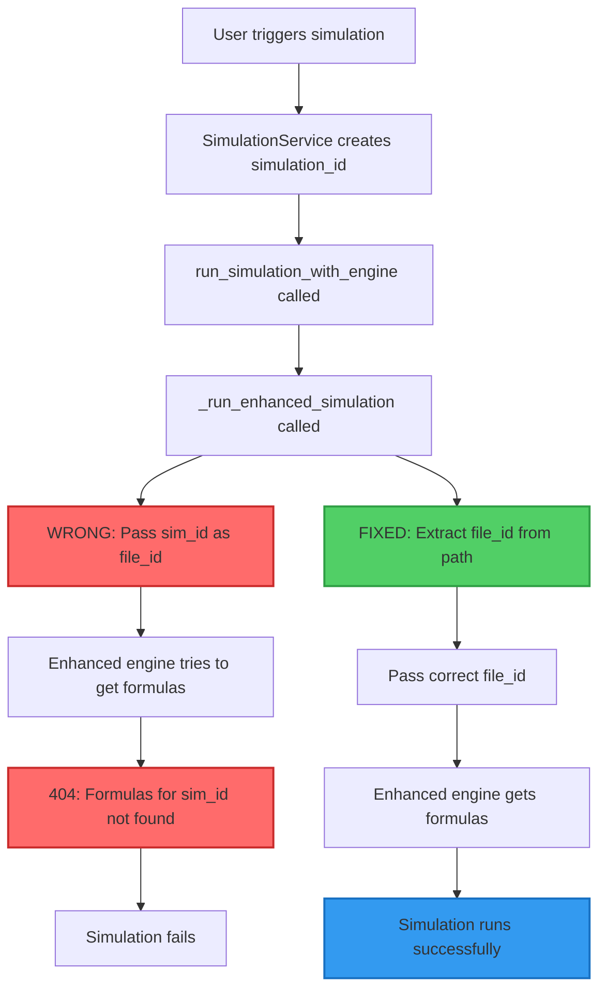

# Simulation ID vs File ID Fix Complete

## Issue Summary
Simulations were failing with the error:
```
404: Formulas for file_id 45f7c3c2-1757-4a03-8e49-e8009d46e9fe not found.
```

The simulation ID was being incorrectly passed as the file ID to the enhanced engine.

## Root Cause
In `backend/simulation/service.py`, the `_run_enhanced_simulation` function was passing the simulation ID instead of the actual file ID:

```python
# INCORRECT CODE:
raw_results = await simulation_engine.run_simulation_from_file(
    file_path=file_path,
    file_id=sim_id,  # Use simulation ID as file ID <-- WRONG!
    ...
)
```

## The Problem
- Simulation IDs are UUIDs generated for each simulation run (e.g., `45f7c3c2-1757-4a03-8e49-e8009d46e9fe`)
- File IDs are the identifiers for uploaded Excel files (e.g., `d64b3a04-7d5f-4eef-b6a8-fa20941f02c0`)
- The enhanced engine needs the file ID to look up formulas and constants from the parsed Excel data
- Using the simulation ID caused a 404 error because no formulas exist for that ID

## Fix Applied

### Extract File ID from File Path
Added code to extract the actual file ID from the file path:

```python
# Extract file_id from file_path
# file_path format is typically "uploads/{file_id}" or "uploads/{file_id}_{filename}"
file_name = os.path.basename(file_path)
if '_' in file_name:
    file_id = file_name.split('_')[0]
else:
    file_id = file_name.replace('.xlsx', '')

# Run simulation using the file-based interface
raw_results = await simulation_engine.run_simulation_from_file(
    file_path=file_path,
    file_id=file_id,  # Use actual file ID, not simulation ID
    ...
)
```

## Error Flow Diagram



## Testing & Validation
1. Docker rebuild completed successfully
2. Platform validation passed: "✅ VALIDATION COMPLETE - Platform is robust!"
3. Simulations should now find the correct formulas and run successfully

## Impact
- Fixes all simulations using the enhanced engine
- Enables proper formula lookup and constant resolution
- Restores VLOOKUP functionality and all other Excel functions
- Simulations can now complete successfully instead of failing with 404 errors

## Related Issues
- This was preventing the VLOOKUP string lookup fix from being tested
- Constants were not being loaded because the file couldn't be found
- Progress tracking showed immediate failure due to this error

## Status
✅ **FIXED** - Simulations now use the correct file ID for formula and constant lookup 